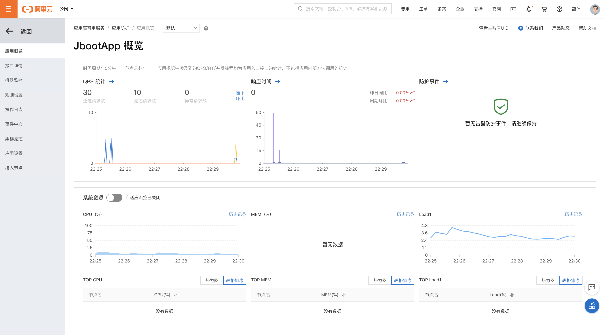

# Sentinel 限流

## 目录

- 概述
- sentinel 的使用

## 概述
随着微服务的流行，服务和服务之间的稳定性变得越来越重要。Sentinel 以流量为切入点，从流量控制、熔断降级、系统负载保护等多个维度保护服务的稳定性。

Sentinel 具有以下特征:

- **丰富的应用场景**：Sentinel 承接了阿里巴巴近 10 年的双十一大促流量的核心场景，例如秒杀（即突发流量控制在系统容量可以承受的范围）、消息削峰填谷、集群流量控制、实时熔断下游不可用应用等。
- **完备的实时监控**：Sentinel 同时提供实时的监控功能。您可以在控制台中看到接入应用的单台机器秒级数据，甚至 500 台以下规模的集群的汇总运行情况。
- **广泛的开源生态**：Sentinel 提供开箱即用的与其它开源框架/库的整合模块，例如与 Spring Cloud、Dubbo、gRPC 的整合。您只需要引入相应的依赖并进行简单的配置即可快速地接入 Sentinel。
- **完善的 SPI 扩展点**：Sentinel 提供简单易用、完善的 SPI 扩展接口。您可以通过实现扩展接口来快速地定制逻辑。例如定制规则管理、适配动态数据源等。


Sentinel 分为两个部分:

核心库（Java 客户端）不依赖任何框架/库，能够运行于所有 Java 运行时环境，同时对 Dubbo / Spring Cloud 等框架也有较好的支持。
控制台（Dashboard）基于 Spring Boot 开发，打包后可以直接运行，不需要额外的 Tomcat 等应用容器。


更多的文档请参考：

https://github.com/alibaba/Sentinel/wiki/%E4%BB%8B%E7%BB%8D


## sentinel 的使用

**第一步，启动 Sentinel dashboard：**

下载 Sentinel 的 jar 到本地，并通过如下方式启动 启动 sentinel dashboard

```shell
java -jar sentinel-dashboard-1.8.0.jar
```

 jar 的下载地址：https://github.com/alibaba/Sentinel/releases

启动时，默认端口号为：8080，可以通过 -Dserver.port=8888 用于指定 Sentinel 控制台端口为 8888。

例如：

```shell
java -Dserver.port=8888 -jar sentinel-dashboard-1.8.0.jar
```

从 Sentinel 1.6.0 起，Sentinel 控制台引入基本的登录功能，默认用户名和密码都是 sentinel。

可以通过如下配置来修改掉默认的账号和密码：
- -Dsentinel.dashboard.auth.username=sentinel 用于指定控制台的登录用户名为 sentinel；
- -Dsentinel.dashboard.auth.password=123456 用于指定控制台的登录密码为 123456；

关于控制台的更多配置，请参考：
https://github.com/alibaba/Sentinel/wiki/%E6%8E%A7%E5%88%B6%E5%8F%B0#%E6%8E%A7%E5%88%B6%E5%8F%B0%E9%85%8D%E7%BD%AE%E9%A1%B9

**第二步：配置项目的 jboot.properties 、 sentinel.properties 和 Maven 依赖**

在 jboot.properties 添加如下配置

```properties
jboot.sentinel.enable = true;

// 是否对 http 请求启用限流，默认值为 true，启用后还需要去 sentinel 后台配置
jboot.sentinel.reqeustEnable = true;

// 配置 sentinel 的前缀，多个用英文逗号隔开，若不配置则所有的都会被拦截
jboot.sentinel.reqeustTargetPrefix = "/my";

// 如果 http 被限流后跳转的页面
jboot.sentinel.requestBlockPage;

 // 如果 http 被限流后渲染的 json 数据，requestBlockPage 配置优先于此项
jboot.sentinel.requestBlockJsonMap;
```
  
在项目的 resource 目录下创建 sentinel.properties 文本，并配置相关信息如下：

```
csp.sentinel.dashboard.server=localhost:8080
```
这个配置指的是 sentinel 配置服务器的地址

关于更多 sentinel.properties 的配置请参考：

https://github.com/alibaba/Sentinel/wiki/%E5%90%AF%E5%8A%A8%E9%85%8D%E7%BD%AE%E9%A1%B9#%E5%9F%BA%E7%A1%80%E9%85%8D%E7%BD%AE%E9%A1%B9


添加 maven 依赖：


```xml
<dependency>
    <groupId>com.alibaba.csp</groupId>
    <artifactId>sentinel-core</artifactId>
    <version>${sentinel.version}</version>
    <scope>provided</scope>
</dependency>

<dependency>
    <groupId>com.alibaba.csp</groupId>
    <artifactId>sentinel-cluster-client-default</artifactId>
    <version>${sentinel.version}</version>
    <scope>provided</scope>
</dependency>

<dependency>
    <groupId>com.alibaba.csp</groupId>
    <artifactId>sentinel-transport-simple-http</artifactId>
    <version>${sentinel.version}</version>
    <scope>provided</scope>
</dependency>
```

如果使用 阿里云 AHAS 替代 sentinel dashboard，需要添加如下依赖（以上依赖不再需要）：


```xml
<dependency>
    <groupId>com.alibaba.csp</groupId>
    <artifactId>ahas-sentinel-client</artifactId>
    <version>1.8.0</version>
</dependency>
```

阿里云 AHAS 截图：



更多关于 阿里云 AHAS 的文档请参考：https://github.com/alibaba/Sentinel/wiki/AHAS-Sentinel-%E6%8E%A7%E5%88%B6%E5%8F%B0


**第三步：配置限流资源**

在项目的任意目录下，使用注解 `@SentinelResource` 给方法进行配置，代码如下：

```java
@RequestMapping("/sentinel")
public class SentinelController extends JbootController {

    @SentinelResource
    public void index(){
        renderText("sentinel index...");
    }
}
```

或者在 Service 中

```java
public class UserService{

    // 原本的业务方法.
    @SentinelResource(blockHandler = "blockHandlerForGetUser")
    public User getUserById(String id) {
        throw new RuntimeException("getUserById command failed");
    }

    // blockHandler 函数，原方法调用被限流/降级/系统保护的时候调用
    public User blockHandlerForGetUser(String id, BlockException ex) {
        return new User("admin");
    }
}
```

然后通过浏览器进入 sentinel dashboard 中心，对 `SentinelController.index()` 和  `UserService.getUserById()` 的资源进行具体的限流参数配置。

关注注解 `@SentinelResource` 更多的配置，请参考文档： https://github.com/alibaba/Sentinel/wiki/%E6%B3%A8%E8%A7%A3%E6%94%AF%E6%8C%81#sentinelresource-%E6%B3%A8%E8%A7%A3

更多的 sentinel dashboard 配置内容请参考：https://github.com/alibaba/Sentinel/wiki/%E6%8E%A7%E5%88%B6%E5%8F%B0