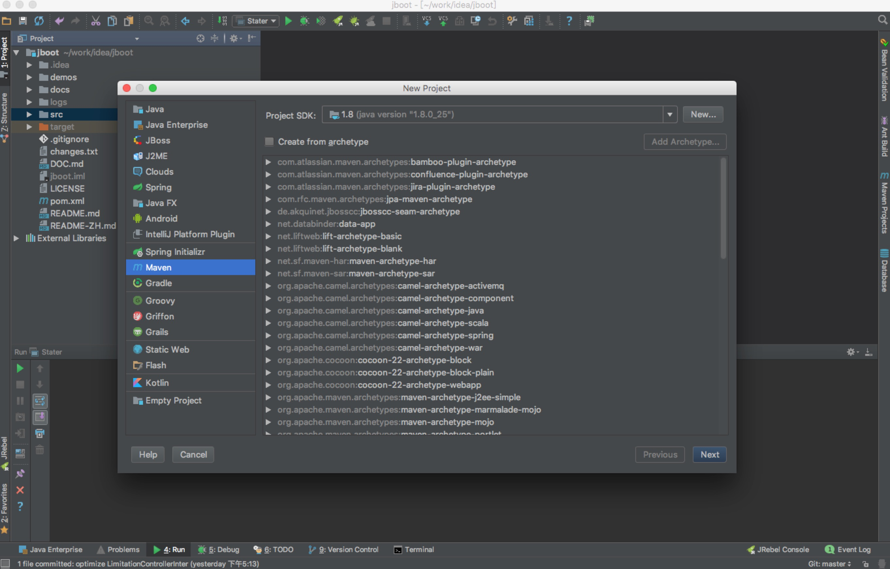
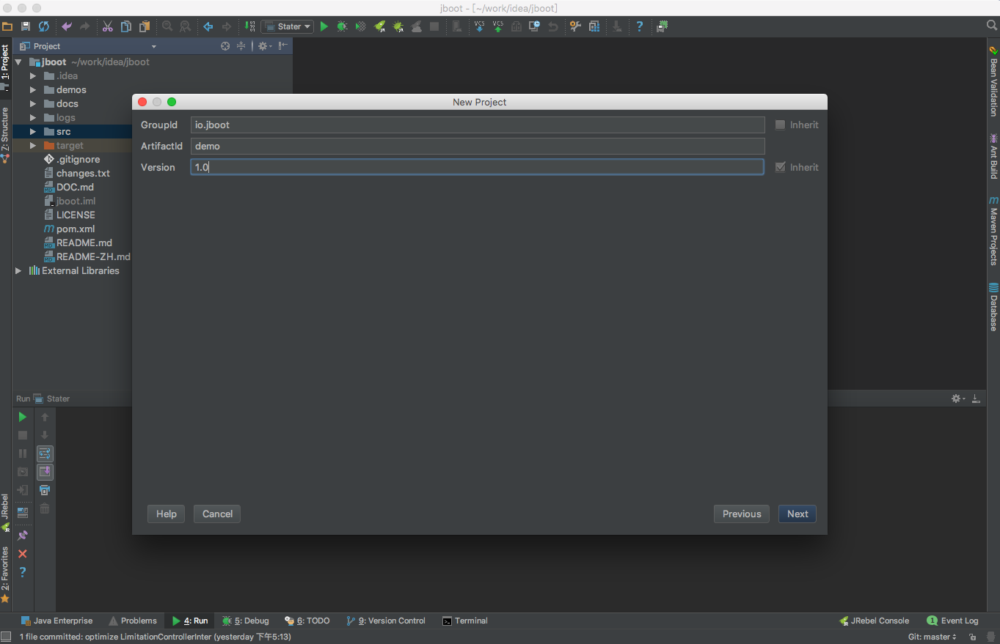
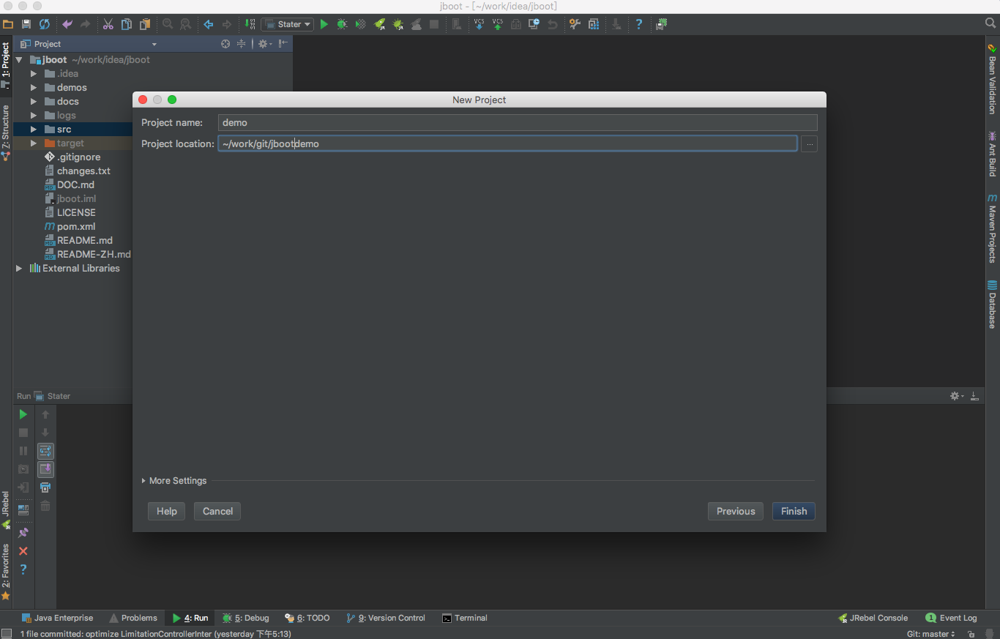
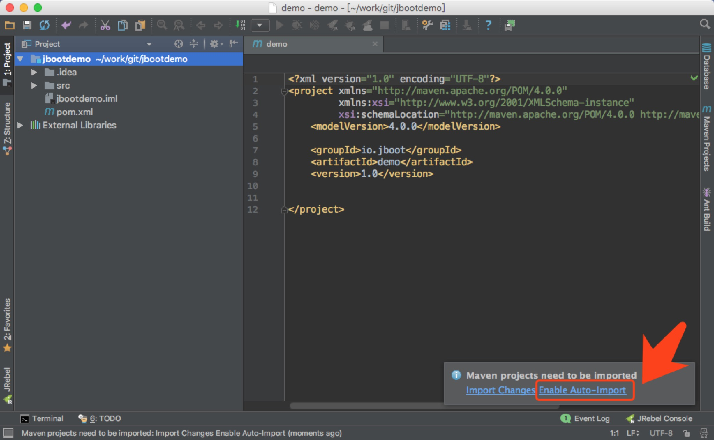
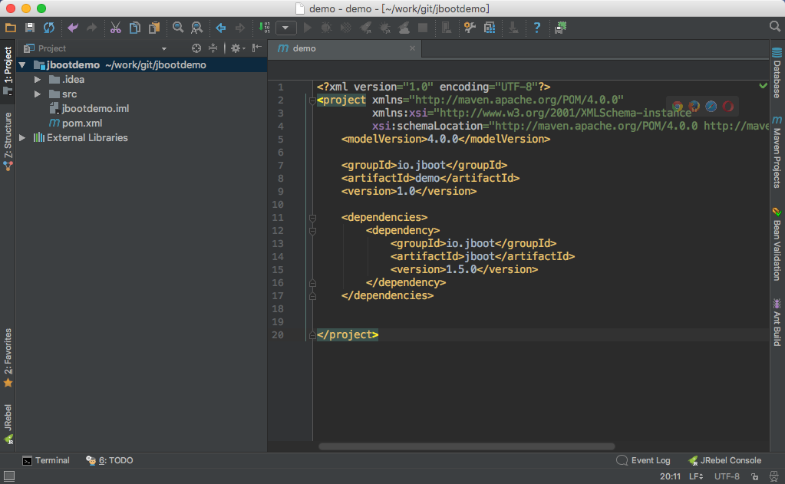
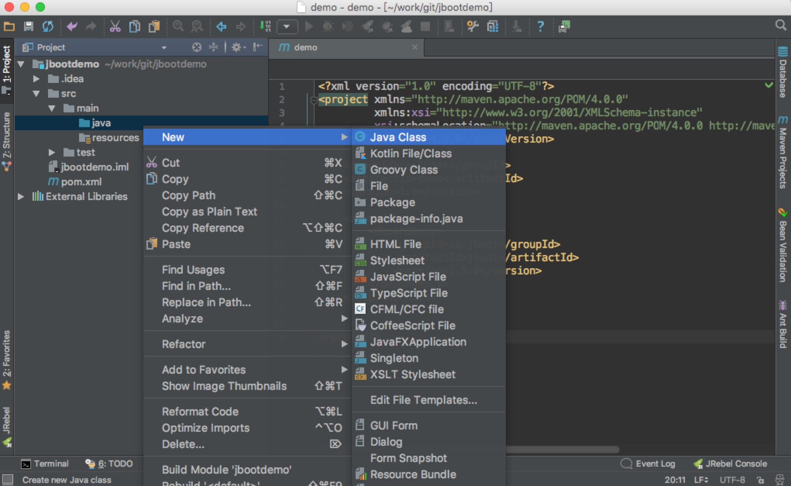
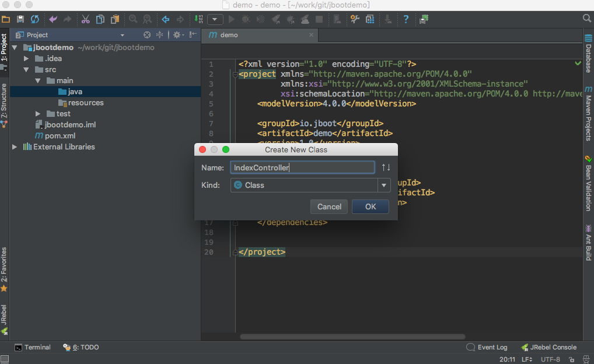

# 开始使用Jboot

Jboot 使用到了如下的技术，了解 Jboot 之前，请先保证您已经了掌握如下技术：
 
 * 熟悉 Java 编程语言
 * 熟悉 maven 的基本原理
 * 熟悉 IntelliJ IDEA 或者 Eclipse 等编辑器的使用

交流 QQ 群:
* 群1：601440615 （已满）
* 群2：719614554 （开放中）

## 创建项目
 
###  通过 IntelliJ IDEA  创建项目

IntelliJ IDEA 下载地址：https://www.jetbrains.com/idea/ ，下载完成后完成后开始安装，安装过程略。

第一步：打开 IntelliJ IDEA 创建 maven 项目，如下图：


第二步：填写 maven 项目的 GroupId、ArtifactId 和 Version

* GroupId 一般是包名，用来做项目的唯一标识
* ArtifactId 一般是项目名
* Version 是项目的版本


第三步：填写 项目存储路径


创建完毕后，我们会看到如下图所示，注意点击 Enable Auto-Import.


###  通过 Eclipse 创建项目
略，和 通过 IntelliJ IDEA  创建项目 基本相同。

## Maven 依赖

通过 以上步骤建立项目后，我们会在项目目录下找到 pom.xml 文件，这个文件是 maven 的核心文件，maven 是通过 pom.xml 对项目进行依赖配置和管理的。

我们需要在 pom.xml 里添加对 Jboot 的依赖配置，如下代码：

```xml
<dependency>
    <groupId>io.jboot</groupId>
    <artifactId>jboot</artifactId>
    <version>3.7.8</version>
</dependency>
```

如下图所示：


## Hello World

一般情况下，对一个新项目的了解是从 Hello World 开始的，因此，我们需要通过 Jboot 来写一个 Hello World 程序。

这个 Hello World 的需求是：

> **通过编写代码，我们在浏览器访问后输出 “Hello World Jboot” 的文字内容。** 

通过以上步骤，我们创建好了项目、添加好了 jboot 的maven依赖，接下来我们需要来创建一个叫 IndexController 的java文件，



IndexController 的代码如下：

```java
import io.jboot.app.JbootApplication;
import io.jboot.web.controller.JbootController;
import io.jboot.web.controller.annotation.RequestMapping;

@RequestMapping("/")
public class IndexController extends JbootController {

    public void index() {
        renderText("Hello World Jboot");
    }


    public static void main(String[] args) {
        JbootApplication.run(args);
    }
}
```
以上代码需要注意以下几点：
1. IndexController 需要继承 JbootController 或者 Controller
1. 需要添加 @RequestMapping("/") 请求映射配置
1. 通过编写 `index()` 方法来接收请求，并向浏览器输出 "Hello World Jboot" , 此处注意：必须叫 `index()`  不能修改名字，后续会讲到其原理。

通过运行 IndexController 的 main() 方法，我们可以看到如下的日志输出：

```

  ____  ____    ___    ___   ______ 
 |    ||    \  /   \  /   \ |      |
 |__  ||  o  )|     ||     ||      |
 __|  ||     ||  O  ||  O  ||_|  |_|
/  |  ||  O  ||     ||     |  |  |  
\  `  ||     ||     ||     |  |  |  
 \____||_____| \___/  \___/   |__|  
                                    


JbootApplication { mode='dev', version='3.7.8', jfinalConfig='io.jboot.core.JbootCoreConfig' }
Classpath : /Users/michael/git/jboot/target/test-classes/
Starting JFinal 4.2 -> http://127.0.0.1:8080
Info: jfinal-undertow 1.6, undertow 2.0.19.Final, jvm 1.8.0_201
ClassScanner scan classpath : /Users/michael/git/jboot/target/test-classes
ClassScanner scan classpath : /Users/michael/git/jboot/target/classes
Starting Complete in 1.3 seconds. Welcome To The JFinal World (^_^)

JbootResourceLoader started, Watched resource path name : webapp
```

我们看到最后一行日志的内容是：

```
server started success , url : http://127.0.0.1:8080/
```
此时我们通过浏览器访问：http://127.0.0.1:8080 , 就可以看到如下内容：


## 链接数据库

在 Java Web 开发中，几乎 99% 以上的项目都需要和数据库打交道，因此，了解 Jboot 如何连接数据成为了必须。

通过 Jboot 连接数据库只需要做两步：
1. 创建 jboot.properties 配置文件
1. 在 jboot.properties 添加数据库连接信息

第一步：在项目的resource目录下创建 jboot.properties 文件，此时，项目的目录结构应该如下：

```
├── pom.xml
├── src
│   ├── main
│   │   ├── java
│   │   │   └── IndexController.java
│   │   └── resources
│   │       └── jboot.properties #注意文件目录不要错了
│   └── test
│       └── java
```

第二步：在 jboot.properties 文件添加如下数据库信息：

```
jboot.datasource.type = mysql
jboot.datasource.url = jdbc:mysql://127.0.0.1:3306/jbootdemo
jboot.datasource.user = root 
jboot.datasource.password =
```

* jboot.datasource.type：配置的是数据库的类型，目前 Jboot 支持的数据库类型有：Mysql 、Oracle 、SqlServer 、Postgresql 、Sqlite 和 其他标准的数据库。
* jboot.datasource.url： 配置的是数据库的连接信息
* jboot.datasource.user： 配置的是数据库的连接账号
* jboot.datasource.password： 配置的是数据库的连接密码，没有密码可以留空

通过配置完毕后，Jboot就已经有了访问数据库的能力，我们可以在 IndexController 写一个 `dbtest()` 方法，来测试下 Jboot 的数据库访问能力，代码如下：

```
@RequestMapping("/")
public class IndexController extends JbootController {

    public void index() {
        renderText("Hello World Jboot");
    }

    public void dbtest(){
        List<Record> records = Db.find("select * from user");
        renderText(Arrays.toString(records.toArray()));
    }


    public static void main(String[] args) {
        JbootApplication.run(args);
    }
}
```
注意：以上代码能够正式运行的前提是：
1. 你本地安装好mysql数据库，并创建好库 `jbootdemo` ，因为数据库的连接url是：`jdbc:mysql://127.0.0.1:3306/jbootdemo`
2. jbootdemo 下要有数据表 user，因为 sql 查询内容是：`select * from user`

例如：作者本地数据库的内容如下：


运行 IndexController 的 `main()` 方法，并访问 `http://127.0.0.1:8080/dbtest`，会看到如下内容所示：


此时，证明 Jboot 已经能够准确访问数据库。


## 使用代码生成器
Jboot 内置了一个简易的代码生成器，通过代码生成器运行，Jboot帮开发者生成每个数据库表对应 java 的 model 实体类，同时可以生成带有增、删、改、查基本数据库操作能力的 service 层代码。

在使用 Jboot 代码生成器之前，我们需要在 jboot.properties 配置好数据库的连接信息（以上内容已经提到）。并编写任意名字带有`main()`方法的执行类，例如我们叫 CodeGenerator， 代码如下：

```java
public class CodeGenerator {

    public static void main(String args[]){
        
        // 配置数据库的数据源
        JbootApplication.setBootArg("jboot.datasource.url", "jdbc:mysql://127.0.0.1:3306/jbootdemo");
        JbootApplication.setBootArg("jboot.datasource.user", "root");
        JbootApplication.setBootArg("jboot.datasource.password", "123456");

        String modelPackage = "io.jboot.test.codegen.model";
        String baseModelPackage = modelPackage + ".base";

        String modelDir = PathKit.getWebRootPath() + "/src/main/java/" + modelPackage.replace(".", "/");
        String baseModelDir = PathKit.getWebRootPath() + "/src/main/java/" + baseModelPackage.replace(".", "/");

        System.out.println("start generate...");
        System.out.println("generate dir:" + modelDir);

        // 生成 Model 
        new JbootBaseModelGenerator(baseModelPackage, baseModelDir).setGenerateRemarks(true).generate();
        new JbootModelGenerator(modelPackage, baseModelPackage, modelDir).generate();


        String servicePackage = "io.jboot.test.codegen.service";
        String serviceImplPackage = "io.jboot.test.codegen.service.impl";

        String serviceOutputDir = PathKit.getWebRootPath() + "/src/main/java/" + servicePackage.replace(".", "/");
        String serviceImplOutputDir = PathKit.getWebRootPath() + "/src/main/java/" + serviceImplPackage.replace(".", "/");

        // 生成 Service 接口 及其 实现类
        new JbootServiceInterfaceGenerator(servicePackage, serviceOutputDir, modelPackage).generate();
        new JbootServiceImplGenerator(servicePackage, serviceImplPackage, serviceImplOutputDir, modelPackage).setImplName("impl").generate();


    }
}
```

运行 CodeGenerator 的 `main()` 方法之后，我们能看到 Jboot 已经帮我们创建好对应的包名和类名，此时，项目的目录如下：

```
├── pom.xml
├── src
│   ├── main
│   │   ├── java
│   │   │   ├── CodeGenerator.java
│   │   │   ├── IndexController.java
│   │   │   └── com
│   │   │       └── xxx
│   │   │           ├── model
│   │   │           │   ├── Article.java
│   │   │           │   ├── User.java
│   │   │           │   └── base
│   │   │           │       ├── BaseArticle.java
│   │   │           │       └── BaseUser.java
│   │   │           └── service
│   │   │               ├── ArticleService.java
│   │   │               ├── UserService.java
│   │   │               └── impl
│   │   │                   ├── ArticleServiceImpl.java
│   │   │                   └── UserServiceImpl.java
│   │   └── resources
│   │       └── jboot.properties
│   └── test
│       └── java
```

通过 Jboot 代码生成器的运行，项目对应的 model 类和 service 会自动生成，同时 Service 层的代码以及带有了对数据库增、删、改、查的基本能力.

需要注意的是：
**再次运行该代码生成器的时候，BaseUser、BaseArticle会被重新覆盖，其他代码不会被覆盖。** 若需要重新生成 service 层 和 User、Article 等代码，需要手动删除后，再次运行代码生成器 CodeGenerator 。

## 自动注入
Jboot 通过 Google Guice 提供了强健稳定的代码注入功能，使用注入功能只需要了解以下三个注解：
1. @Bean : 声明此类可以被自动注入
2. @Inject : 对属性进行赋值注入

通过代码生成器生成的Service层代码就已经默认添加上了 @Bean 和 @Singleton 这两个配置，生成的代码如下：

```java
package com.xxx.service.impl;

import io.jboot.aop.annotation.Bean;
import com.xxx.service.UserService;
import com.xxx.model.User;
import io.jboot.service.JbootServiceBase;

import javax.inject.Singleton;

@Bean
public class UserServiceImpl extends JbootServiceBase<User> implements UserService {

}
```

我们使用到 UserService 接口的时候，只需要添加 @Inject 注解即可，例如：在 IndexController 需要用到 UserService，代码如下：

```java
@RequestMapping("/")
public class IndexController extends JbootController {

    @Inject
    private UserService userService;

    public void index() {
        renderText("Hello World Jboot");
    }

    public void dbtest() {
        List<Record> records = Db.find("select * from user");
        renderText(Arrays.toString(records.toArray()));
    }


    public void users() {
        // 这里用到了 userService 的查询方法
        List<User> users = userService.findAll();
        renderText(Arrays.toString(users.toArray()));
    }


    public static void main(String[] args) {
        Jboot.run(args);
    }
}
```

运行 `main()` 方法后，我们通过浏览访问 `http://127.0.0.1:8080/users` ，此时，页面显示的内容和 访问 `http://127.0.0.1:8080/dbtest` 的效果是一样的：


## 数据库的增删改查
在本章节，我们要完成一个小型的项目，这个项目是一个用户管理系统，他具有以下功能：

* 显示用户列表，带有分页的功能
* 可以对单个用户删除
* 可以对用户进行修改
* 可以添加新的用户

### 分页查询

我们可以继续来改造 IndexController，通过修改代码生成器的生成的 UserService，来达到上述要求的功能。

在上述的章节里，我们知道，通过如下的代码可以获得所有的用户信息：

```java
 public void users() {
    List<User> users = userService.findAll();
    renderText(Arrays.toString(users.toArray()));
}
```

如果要分页，我们需要在UserService添加一个分页的方法，并在 UserServiceImpl 来实现这个分页的方法，代码如下：

UserService.java

```java
public interface UserService {

    // 代码生成器生成的其他方法略
    //...

    public Page<User> paginate(int page, int size);
}
```

UserServiceImpl.java

```java
@Bean
public class UserServiceImpl extends JbootServiceBase<User> implements UserService {

    public Page<User> paginate(int page, int size) {
        return DAO.paginate(page, size);
    }
}
```

为了代码更加简洁直观，我们新建一个 UserController 来做用户相关的增删改查功能，代码如下：

```java
@RequestMapping("/user")
public class UserController extends JbootController {

    @Inject
    private UserService userService;

    public void index() {
        int page = getParaToInt("page", 1);
        Page<User> userPage = userService.paginate(page, 10);
        setAttr("pageData", userPage);
        render("/user.html");
    }

}
```

* `getParaToInt()` 可以获得request提交过来的page数据，例如：http://127.0.0.1:8080/user?page=100 ，此时，代码里 page 的值是 100，当不传值得时候，默认值是 1 。
* 通过 userService.paginate 查询数据库，返回一个 Page 对象，里面包含了 当前页码、总页码 和 数据列表等信息。
* 通过 `setAttr()` 把数据结果传递到页面

把数据传递到 user.html 后，需要 user.html 把具体的数据和分页相关在网页上列出来。

第一步：完善数据的显示，user.html内容如下：

```html
<!DOCTYPE html>
<html lang="en">
<head>
    <meta charset="UTF-8">
    <title>user index</title>
</head>
<body>
<table >
    <tr>
        <th>ID</th>
        <th>登录名</th>
        <th>密码</th>
    </tr>
    #for(user : pageData.list )
    <tr>
        <td>#(user.id)</td>
        <td>#(user.login_name)</td>
        <td>#(user.password)</td>
    </tr>
    #end
</table>
</body>
</html>
```
此时，运行 `main()` 方法，访问 `http://127.0.0.1:8080/user` ，页面显示内容如下：


第二步：完善分页功能。

Jboot应用的分页功能需要自定义一个分页标签，自定义分页标签非常简单，代码内容如下：

```java
@JFinalDirective("myPaginate")
public class MyPaginateDirective extends JbootPaginateDirective {

    protected String getPageAttrName() {
        return "pageData"; //这个值要和Controller里setAttr的第一个参数值相同
    }
}

```
然后再修改 user.html 内容如下：

```html
<!DOCTYPE html>
<html lang="en">
<head>
    <meta charset="UTF-8">
    <title>user index</title>
</head>
<body>
<table >
    <tr>
        <th>ID</th>
        <th>登录名</th>
        <th>密码</th>
    </tr>
    #for(user : pageData.list )
    <tr>
        <td>#(user.id)</td>
        <td>#(user.login_name)</td>
        <td>#(user.password)</td>
    </tr>
    #end
</table>
#myPaginate()
    #for(page : pages)
        <a href="#(page.url??)" >#(page.text??)</a>
    #end
#end
</body>
</html>
```

此时，运行 `main()` 方法，访问 `http://127.0.0.1:8080/user` ，页面显示内容如下：


由于数据量太小，同时在我们的代码里，要求每页显示10条数据，所以页面才显示了第一页，当我们在数据库添加数据量超过10条的时候，页面显示内容如下：


同时，上一页、下一页等功能正常使用，如下图：


实际上，#myPaginate() 自定义分页标签还可以做更多的配置，包括功能和样式等，但是这不是本章节要讨论的内容了。

### 新增功能
为了实现新增功能，我们需要写一个叫 add.html 的页面，并写对应的 Controller，保证可以访问。

add.html 的代码如下：

```html
<!DOCTYPE html>
<html lang="en">
<head>
    <meta charset="UTF-8">
    <title>user add</title>
</head>
<body>
<form action="/user/doSave" method="post">
    登录名： <input type="text" name="login_name"> <br/>
    密码： <input type="text" name="password"> <br/>
    <input type="submit" value="提交数据">
</form>
</body>
</html>
```

通过 add.html 内容我们能看到，当用户点击 `提交数据` 按钮的时候，页面会把数据提交到 `/user/doSave` 这个路径上去，所以，需要我们在 UserController 编写一个叫做 `doSave（）` 的方法来接收数据，并保存到数据库。

doSave() 方法内容如下：

```java
public void doSave() {
    String loginName = getPara("login_name");
    String password = getPara("password");

    User user = new User();
    user.setLoginName(loginName);
    user.setPassword(password);

    user.save();

    redirect("/user");
}
```

`doSave(）` 方法的主要作用是接收数据、把数据保存到数据库、然后跳转到 `/user` 这个页面去。

### 修改功能

为了减少代码量，我们直接把 add.html 改造成为可用做新增，也可以用作修改的功能（通常在商业项目中也会这么做），因此，我们需要简单修改下 add.html 代码和 add() 这个方法的代码。

add.html 

```html
<!DOCTYPE html>
<html lang="en">
<head>
    <meta charset="UTF-8">
    <title>user add</title>
</head>
<body>
<form action="/user/doSave" method="post">
    <input type="hidden" name="id" value="#(id ??)">
    登录名： <input type="text" name="login_name"> <br/>
    密码： <input type="text" name="password"> <br/>
    <input type="submit" value="提交数据">
</form>
</body>
</html>
```

和新增功能的html对比，增加了 `<input type="hidden" name="id" value="#(id ??)">` 这行代码。

add() 方法内容如下：

```java
public void add() {
    int id = getParaToInt("id", 0);
    if (id > 0) { //有id ，说明有数据提交过来，用来做修改的标识。
        setAttr("id", id);
    }
    render("/add.html");
}
```

同时， doSave()方法也需要修改下，用来区分是新增还是修改，代码如下：

```java
public void doSave() {
    String loginName = getPara("login_name");
    String password = getPara("password");

    long id = getParaToLong("id",0l);


    User user = new User();
    user.setLoginName(loginName);
    user.setPassword(password);
    
    if (id > 0){ //说明是更新
        user.setId(id);
        user.update();
    }else { //说明是新增
        user.save();
    }

    redirect("/user");
}
```

最后，我们在改造下 user.html ,在表格的后面添加一个 `修改` 的连接， user.html 代码如下：

```html
<!DOCTYPE html>
<html lang="en">
<head>
    <meta charset="UTF-8">
    <title>user index</title>
</head>
<body>
<table >
    <tr>
        <th>ID</th>
        <th>登录名</th>
        <th>密码</th>
        <th>操作</th>
    </tr>
    #for(user : pageData.list )
    <tr>
        <td>#(user.id)</td>
        <td>#(user.login_name)</td>
        <td>#(user.password)</td>
        <td><a href="/user/add?id=#(user.id)">修改</a></td>
    </tr>
    #end
</table>
#myPaginate()
    #for(page : pages)
        <a href="#(page.url??)" >#(page.text??)</a>
    #end
#end
</body>
</html>
```

此时，页面内容如下，修改功能正常使用。


### 删除功能

删除功能更加简单，只需要在Controller接收ID，然后调用 userService.delete() 方法就可以了，改造 user.html 代码如下：

```html
<!DOCTYPE html>
<html lang="en">
<head>
    <meta charset="UTF-8">
    <title>user index</title>
</head>
<body>
<table >
    <tr>
        <th>ID</th>
        <th>登录名</th>
        <th>密码</th>
        <th>操作</th>
    </tr>
    #for(user : pageData.list )
    <tr>
        <td>#(user.id)</td>
        <td>#(user.login_name)</td>
        <td>#(user.password)</td>
        <td>
            <a href="/user/add?id=#(user.id)">修改</a>
            <a href="/user/del?id=#(user.id)">删除</a>
        </td>
    </tr>
    #end
</table>
#myPaginate()
    #for(page : pages)
        <a href="#(page.url??)" >#(page.text??)</a>
    #end
#end
</body>
</html>
```

页面显示如下：


我们只需要在 UserController 编写一个 del() 方法，接收id、删除数据库数据，并跳转回 /user 即可完成任务，代码如下：

```java
  public void del() {
    long id = getParaToLong("id",0l);
    userService.deleteById(id);
    redirect("/user");
}
```

到目前为止，增删改查所有功能完成。


## 使用缓存提高性能
通过以上内容，我们可以使用Jboot开发一个具有增、删、改、查基本功能的Java Web 应用，但是，在互联网的应用里，高并发的要求可以说是必不可少的，缓存在提高应用性能和并发上有绝对的话语权。

在 Jboot 里，我们如何来使用缓存呢？

Jboot 提供了两种方案：

1. 注解
1. 手写代码

在注解中，Jboot提供了4个注解，方便的对缓存进行操作，他们分别是：

* @Cacheable 
* @CachePut 
* @CacheEvict
* @CachesEvict

如何来使用呢？

在以上的章节里，我们知道，如下的代码是一个分页查询的功能：

```java
public class UserServiceImpl extends JbootServiceBase<User> implements UserService {

    public Page<User> paginate(int page, int size) {
        return DAO.paginate(page, size);
    }
}
```

如何来让 `paginate(int page, int size)` 方法具有缓存的功能呢？

非常简单：

```java
public class UserServiceImpl extends JbootServiceBase<User> implements UserService {

    @Cacheable(name = "myCache",key = "page:#(page)-#(size)")
    public Page<User> paginate(int page, int size) {
        return DAO.paginate(page, size);
    }
}
```
只需要添加 `@Cacheable(name = "myCache",key = "page:#(page)-#(size)")` 这个注解。

在Jboot中，默认的缓存为 `EhCache` , 这个注解的含义是：

* 在EhCache中创建一个缓存为myCache的缓存区
* 当查询第 1 页的时候，缓存的key为：`page:1-10`，因为 `paginate(int page, int size)` 方法在执行的时候，传递过来的值分别是：page=1，size=10
* 当查询第 2 页的时候，缓存的key为：`page:2-10`，原因同上。

当 `paginate(int page, int size)` 方法使用 @Cacheable 缓存之后，只有第一次访问的时候去查询数据库，之后的访问会直接从缓存中获取数据，大大提高了性能。

但是...

使用缓存也会带来一些问题，因为 `paginate(int page, int size)` 方法不再访问数据库，从而导致我们在数据库对数据进行增、删、改，这个页面数据都不会再发生变化。

要让 `paginate(int page, int size)` 方法与数据库同步，怎么办呢？

需要我们在对数据库进行 增、删、改 的时候，清除这个方法里的缓存数据。

代码如下：

```java
public class UserServiceImpl extends JbootServiceBase<User> implements UserService {

    @Cacheable(name = "myCache",key = "page:#(page)-#(size)")
    public Page<User> paginate(int page, int size) {
        return DAO.paginate(page, size);
    }

    @Override
    @CacheEvict(name = "myCache",key = "*")
    public boolean save(User model) {
        return super.save(model);
    }

    @Override
    @CacheEvict(name = "myCache",key = "*")
    public boolean update(User model) {
        return super.update(model);
    }

    @Override
    @CacheEvict(name = "myCache",key = "*")
    public boolean delete(User model) {
        return super.delete(model);
    }
}
```
重写父类 `JbootServiceBase` 的增、删、改的方法，在这些方法添加 `@CacheEvict(name = "myCache",key = "*")` 注解。

**被添加@CacheEvict的方法，在执行之后，会清除 name 为 myCache 的所有key。** 也就是清除 `paginate(int page, int size)` 方法所有的 key 。

这样，就做到了 `paginate(int page, int size)` 方法与数据库同步的功能了。是不是非常简单呢 ？！

不过 ...

以上，只是 Jboot 缓存功能的冰山一角，Jboot 的缓存非常强大，比如：

 * @CachePut 和 @CachesEvict 又如何使用？什么场景下使用？
 * 如何使用 Redis 或者其他的缓存方案代替默认的 EhCache ，甚至是公司自己内部的缓存方案 ?
 * 分布式缓存如何做 ?
 * 如何设置缓存的失效时间 ?
 * 如何做到整个网页缓存，类似页面静态化？
 * 等等等等

Jboot 都给与类非常完美的支持。

## 探索Jboot的更多功能...

恭喜你，到目前为止，你已经掌握了使用 Jboot 来开发一个 java web 的基本技能，包含了

* MVC
* ORM
* AOP
* 代码生成器
* 使用缓存提高性能
* 等等

这是非常重要的一步。

但是，Jboot 的功能远远不止这些，以上只是 Jboot 的冰山一角。

Jboot 真正的核心是做微服务的开发，微服务的底层代码是分布式调用RPC，RPC 的框架和实现的方案非常繁杂，不过 Jboot 已经支持了主流 RPC 的实现，其中包含了 Dubbo 、motan、Zbus等， 未来还会添加 gRPC 等更多的支持。

* 在 RPC 下，Jboot 支持了 RPC 下的 熔断、降级、监控、Opentracing等等功能
* 在分布式下，Jboot 支持了分布式缓存、分布式Session、分布式锁、分布式任务、统一配置中心
* 在数据库下，Jboot 支持分库分表、支持 Reids 等nosql数据库的极简调用
* 在 MQ 下，Jboot 支持 rabbitmq、redismq、zbus 甚至还支持了 阿里云的商业MQ
* 另外，Jboot还支持了Swagger、Event事件机制、高并发下的限流方案等等更多的惊喜


希望你用的顺手、开心，如果有什么问题，可以通过 顶部菜单的 提问 链接进行提问，我回在第一时间回复您。
